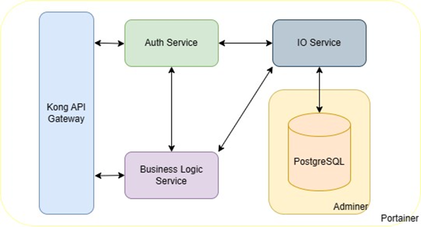

# Proiect IDP -- Infrastructura

## Arhitectura


Au fost create automatizari cu ajutorul Github Actions pentru push pe Docker Hub (pentru serviciile [auth](https://github.com/Proiect-IDP-Cazanov-Catruc/auth-service), [business-logic](https://github.com/Proiect-IDP-Cazanov-Catruc/business-logic-service) si [i/o](https://github.com/Proiect-IDP-Cazanov-Catruc/io-service)).

Github Actions pentru actualizarea parametrilor infrastructurii pe [AKS](https://learn.microsoft.com/en-us/azure/aks/).
## Schimbari fata de documentatia initiala
Am decis sa schimb serviciul folosit pe post de Gateway `Kong` -> `nginx` din
cauza ca nu am reusit sa setez rutele sa functioneze corect.

## Externe
  - [Kubegres](https://www.kubegres.io/)
  - [Grafana Dashboard](https://grafana.com/grafana/dashboards/315-kubernetes-cluster-monitoring-via-prometheus/)
  - [Postgres Exporter](https://github.com/prometheus-community/postgres_exporter)

## Remote cluster prerequisites
```bash
kubectl apply -f https://raw.githubusercontent.com/reactive-tech/kubegres/v1.18/kubegres.yaml
```
```bash
kubectl create namespace idp
```

Apply `db-secret` to `idp` namespace containing keys `superUserPassword` and `replicationUserPassword`.

## Servicii expuse & monitoring/management
### [Nginx](https://hub.docker.com/_/nginx)
Expus la portul `30000`.
### [Adminer](https://hub.docker.com/_/adminer/)
```
/adminer
```
### Auth service
[Details](https://github.com/Proiect-IDP-Cazanov-Catruc/auth-service?tab=readme-ov-file#exposed-endpoints)
### Business logic service
[Details](https://github.com/Proiect-IDP-Cazanov-Catruc/business-logic-service?tab=readme-ov-file#exposed-endpoints)
### [Portainer](https://www.portainer.io/)
```
/portainer
```
### [Grafana](https://grafana.com/)
```
/grafana
```
### [Prometheus](https://prometheus.io/)
```
/prometheus/graph
```
Acest serviciu nu a fost menit sa fie expus. Lasat in scopuri de demonstratie.
## Testare
Deployment pe [minikube](https://minikube.sigs.k8s.io/docs/start/) local:
```powershell
.\deploy.ps1
```
  - Testat pe cluster `minikube` local cu 2 noduri.
  - Testat pe [AKS](https://learn.microsoft.com/en-us/azure/aks/) cu 2 noduri.